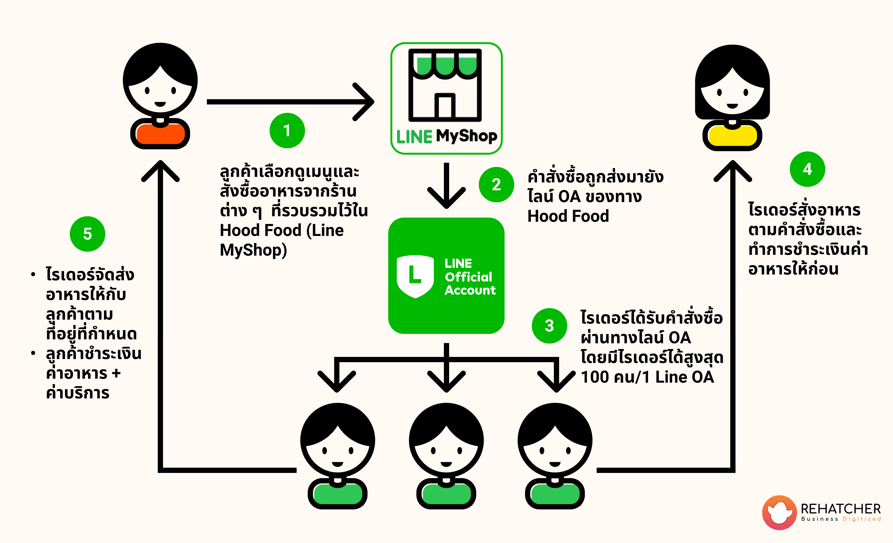

ในพื้นที่ที่ Food Delivery เจ้าใหญ่ยังไม่แพร่หลาย ท่านสามารถใช้ Platform ร้านค้าที่มีอยู่ประยุกต์ให้เกิดบริการส่งอาหาร และ ก่อให้เกิดรายได้ในชุมชนกันได้ เช่นการใช้ [LINE MyShop](https://lineshoppingseller.com/)

<li>ในกรณีที่ร้านค้า และ ลูกค้า มิได้เข้าถึงเทคโนโลยีอย่างทั่วถึง ร้านค้าในท้องที่ไม่จำเป็นจะต้องเป็นสมาชิก Platform หรือเฝ้ามองหน้าจอ LINE ตลอดเวลาเพื่อรับ Order และ แต่ลูกค้าอย่างน้อยควรมี LINE เพื่อใช้ติดต่อกับร้านของท่าน ที่ทำเสมือนเป็นศูนย์รวมอาหารของพื้นที่ 
</li>
<li>สมมติว่าร้านชื่อ Hood Food รายการสินค้าของร้าน Hood Food จะแสดงเป็นร้านอาหารในท้องที่แทน เช่น ก๋วยเตี๋ยวป้าแดง ข้าวมันไก่ลุงแช่ม เป็นต้น 
</li>
<li>ลูกค้าที่เข้ามาที่ Hood Food ผ่าน LINE MyShop จะเห็นชื่้อร้านอาหารและเริ่มการสนทนา Hood Food จะทำการติดต่อกับ Rider ให้และ Rider จะเป็นคู่สนทนากับลูกค้าเพื่อรับ Order เอง จากนั้น Rider จะไปที่ร้านป้าแดง เพื่อสั่งอาหาร จ่ายเงินโดยที่ Rider ออกเงินไปก่อน นำไปส่งให้ลูกค้า และ เก็บเงินกับลูกค้า โดยบวกค่าจัดส่ง ซึ่งอาจคำนวณจากระยะทางตาม GPS เป็นอัตราต่อกิโลเมตร บวกค่าธรรมเนียมสำหรับ Hood Food
</li>
การประยุกต์ใช้ Platform ที่มีอยู่แล้วช่วยให้เข้าถึงลูกค้าที่มีบนฐานเดิมของ Platform ได้เร็วขึ้น ใช้เวลาในการพัฒนาสั้น และ การลองผิดลองถูกนั้นประหยัดมากกว่าการผลิต Software ขึ้นมาโดยเฉพาะ
